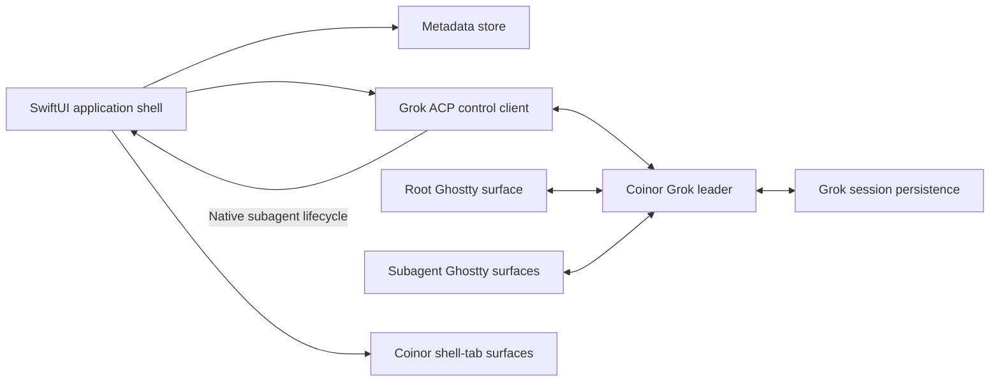

# Coinor architecture

## Purpose

The user-visible product name is Conan Code. The repository, module, app
bundle, and compatibility identifiers retain the internal name Coinor.

Coinor is a personal, native macOS application that gives Grok conversations a
Codex-like project sidebar and a Herdr-like multi-pane experience without
embedding either Paseo or Herdr.

Grok owns conversation state and execution. Coinor owns presentation,
organization metadata, terminal processes, and pane layout.

## Scope

Coinor deliberately supports:

- macOS 13 or newer
- the custom Grok binary used on this computer
- one main application window
- local Git repositories and their worktrees
- registered remote Macs reached over `ssh`, and their repositories
- interactive root and subagent terminal panes
- local organization metadata

Coinor deliberately does not provide:

- cross-platform support
- its own transcript or task persistence
- a terminal or PTY server of its own, or any network listener; a remote
  computer's Grok leader does survive application exit (ADR-0014), but Coinor
  neither implements nor hosts it
- compatibility with arbitrary Grok versions
- Herdr or Paseo runtime dependencies
- cloud synchronization of Coinor metadata
- distribution through the Mac App Store or operation inside App Sandbox

## System shape



There are two separate integration planes:

1. The control plane uses ACP JSON-RPC for session catalog, activity, rename,
   and lifecycle coordination.
2. The render plane uses embedded Ghostty surfaces running the actual Grok TUI.

Coinor never parses terminal output to infer application state.

## Application components

### App coordinator

`AppCoordinator` owns the application lifecycle and composes the control
client, metadata store, project catalog, conversation runtimes, lifecycle
coordinator, and notification service.

It starts the isolated Grok leader before restoring the last visible
conversation and shuts down Coinor-owned clients when the application exits.

### Grok control client

`GrokControlClient` is a long-lived ACP JSON-RPC client implemented in Swift. It
starts Grok in stdio agent mode against Coinor's private leader socket:

```text
grok --leader-socket <coinor-socket> agent --leader stdio
```

Its responsibilities are:

- resolve and retain an absolute path to the configured Grok executable
- initialize the ACP connection
- page through `x.ai/session/list` for persisted session metadata and facets
- call `x.ai/sessions/list` for live and dormant activity state
- consume `x.ai/sessions/changed` notifications
- call `x.ai/session/rename` for root conversations
- provide explicit health and compatibility errors to the UI

The session catalog and live roster are joined by Grok session ID. Catalog rows
own project/worktree metadata; roster rows own current activity and residency.

### Isolated Grok leader

All Coinor-owned Grok clients use one socket beneath Coinor's Application
Support directory. Coinor passes `--leader` and `--leader-socket` explicitly;
it does not modify the machine-wide `use_leader` setting.

The leader exists because the root TUI and each visible subagent TUI must
subscribe to the same in-memory Grok sessions. The original root client remains
the session driver while additional clients receive replay and live updates.

Leader mode requires a Grok configuration that is eligible for leader
operation. Coinor must surface a clear startup error if Grok refuses leader
mode, including sandbox-policy failures.

### Agent terminal control

Conan Code hosts a second private Unix socket for long-running-command control.
The app bundle supplies `coinorctl` and a zsh bootstrap, while an app-owned
Grok skill provides the agent workflow.

The private leader inherits the control socket path, bundled client path, and
an ephemeral instance token. Tab creation additionally requires a literal
nonce observed in the matching ACP `run_terminal_command` event. The event
provides the exact root or subagent session ID; Coinor maps it to the loaded
conversation runtime. Later operations require the tab's random capability.

The protocol is one newline-delimited JSON request and response per Unix
connection. The listener verifies the peer UID, keeps the socket at mode 0600,
and performs Ghostty operations on `MainActor`.

### Conversation runtime manager

`ConversationRuntimeManager` owns every conversation activated during the
current application run.

Each runtime contains:

- one root terminal process and Ghostty surface
- zero or more subagent terminal processes and Ghostty surfaces
- two permanent IDE terminal processes and Ghostty surfaces
- zero or more independent shell processes and Ghostty surfaces
- zero or more transient agent-managed zsh processes and Ghostty surfaces
- local terminal-tab order, labels, selection, and focus state
- current root and descendant activity
- pane ordering and focus state

Changing the selected conversation does not stop its runtime. Application
relaunch restores only the last visible runtime; other sessions resume lazily.

New root conversations use a Coinor-generated UUID passed to Grok so the UI
knows the durable session ID before the TUI finishes starting:

```text
grok --leader-socket <socket> --leader \
  --cwd <checkout> --session-id <uuid>
```

Existing conversations launch directly through:

```text
grok --leader-socket <socket> --leader \
  --cwd <session-cwd> --resume <session-id>
```

### Ghostty runtime

Coinor statically links `GhosttyKit.xcframework` built from a pinned Ghostty
source revision. It does not load or depend on `/Applications/Ghostty.app`.

`GhosttyRuntime` is the only module that imports the Ghostty C API.
`GhosttySurfaceView` bridges an AppKit surface into SwiftUI through
`NSViewRepresentable`.

At startup, the runtime:

1. points `GHOSTTY_RESOURCES_DIR` at Coinor's bundled resources
2. calls `ghostty_init` exactly once
3. creates one shared Ghostty application handle
4. creates a configuration and loads Ghostty's default and recursive files
5. loads Coinor's bundled overrides after user configuration
6. finalizes the configuration and reports diagnostics
7. creates one surface per root or subagent pane

Each surface inherits the user's normal font, colors, and terminal behavior.
Coinor overrides the surface command, working directory, environment, and
initial size required by the pane.

The bundled override sets `mouse-shift-capture = never`. Grok uses terminal
mouse reporting for its interactive rows, so `GhosttySurfaceView` distinguishes
clicks from drags while capture is active:

- an ordinary click is replayed to Grok unchanged
- two clicks remain two ordinary press/release pairs for Grok's double-click
  detection
- the first drag event replays the deferred press with Shift so Ghostty starts
  native selection
- subsequent drag and release events retain Shift only for that selection

AppKit mouse locations are sent to Ghostty in logical points rather than
Retina backing pixels. Enter, move, exit, right-drag, and auxiliary-drag events
are forwarded so hover state does not remain stale across panes. Exiting sends
Ghostty's `(-1, -1)` sentinel when no button is pressed. A right click with an
active selection opens Coinor's standard Copy/Paste/Select All menu; otherwise
the right click remains available to Grok.

Scroll events preserve AppKit's high-precision flag and momentum phase in
Ghostty's packed scroll-modifier bitmask. Precise deltas are forwarded without
Ghostty.app's hardcoded 2x multiplier, allowing Ghostty to accumulate trackpad
movement in pixels before advancing terminal rows. Discrete mouse-wheel events
remain unmarked and continue to use Ghostty's wheel-tick behavior. This routing
exists only in `GhosttySurfaceView`, so the SwiftUI sidebar retains native
scroll behavior.

`GhosttyActionBridge` handles clipboard completion, close requests, cursor
state, title and working-directory updates, URL opening, renderer health, and
configuration reload. Ghostty actions that would create native Ghostty
windows or splits are ignored. New-tab, close-tab, move-tab, go-to-tab, and
explicit tab-title actions are mapped to the selected conversation's
Coinor-owned tabs rather than creating UI outside Coinor's pane model.

Ghostty wakeups can arrive off the main thread; the adapter schedules
`ghostty_app_tick` and AppKit work on `MainActor`. Surface callback userdata is
unretained, so the runtime owns explicit lifetimes and always destroys every
surface before freeing the shared application handle.

The pinned Ghostty revision, C header, static framework, and resources are one
indivisible build artifact. Coinor builds its copy with Ghostty crash reporting
disabled. A Ghostty update is an explicit dependency update followed by
terminal integration tests.

### Native Grok lifecycle

Grok publishes `subagent_spawned`, `subagent_progress`, and
`subagent_finished` updates through the same ACP connection Coinor already
uses for its control plane. Coinor consumes those native notifications and
recursively replays persisted lifecycle updates after reconnecting or opening
an existing conversation. It does not install global hooks, run an auxiliary
relay, or create a lifecycle socket.

The lifecycle update identifies the immediate parent and child session IDs.
Coinor maps every descendant back to the activated root conversation, opens a
Ghostty surface, and runs:

```text
grok --leader-socket <socket> --leader \
  --cwd <event-cwd> --resume <subagent-id>
```

The native start update can arrive before the new child has written its
persisted summary. A small Coinor launcher retries only the exact "session does
not exist" startup failure for a bounded period, then hands the successful Grok
TUI to the same terminal. Other failures surface immediately.

Lifecycle handling is idempotent by subagent ID. Start/finish events are
generation-checked so a delayed start cannot resurrect a pane after its
finish. Events received before a root runtime is ready are buffered. Closing a
root runtime closes all of its descendant panes.

The ACP stream can be interrupted by cancellation, provider failure, leader
restart, or abrupt parent death. The lifecycle reconciler therefore also:

- closes every descendant when the ultimate root terminal process exits
- observes child persisted events for cancellation or terminal outcomes
- keys liveness to the root session, never an intermediate nested subagent
- immediately restores the descendant tree when a pane opens
- periodically replays lifecycle state while descendants remain active

### Pane layout

Each conversation runtime renders a compact tab strip and keeps all of its
terminal surfaces mounted:

- main selected, root only: one full-width Grok terminal
- main selected with descendants: a fixed 50/50 horizontal split
- main right side: equal-height vertical tracks in subagent start order
- IDE selected: a fixed 60/40 horizontal split, with `fresh .` on the left and
  `lazygit` on the right
- shell selected: one full-width independent Ghostty shell
- managed tab selected: one full-width reusable Ghostty zsh shell

The main layout, IDE layout, and every ordinary or managed shell tab are
layered in a `ZStack`;
selection changes opacity, hit testing, accessibility visibility, and focus
without destroying surfaces. Main remembers the last focused root or
descendant pane. IDE remembers the last focused IDE pane and initially focuses
Fresh. Attention can redirect focus only while main is selected.

All surfaces remain mounted while their conversation runtime is live, even
when another conversation is selected. Hidden runtimes do not lose their PTY
or in-flight work.

The first two tabs have stable internal identities `main` and `ide`. Both are
non-closable and remain ahead of every shell tab. IDE is also non-renameable.
Its two command surfaces are created eagerly with the conversation runtime and
run in the resolved Git root of the conversation's checkout or worktree.

Shell tabs use local UUIDs and launch with no explicit command in the
conversation's authoritative persisted working directory. New worktree
conversations defer terminal command launch until the Grok roster or persisted
session reports the worktree path; they never fall back to the source checkout.
Ghostty therefore selects the user's configured shell for ordinary shell tabs.
The IDE commands and persisted shell tabs are recreated when their conversation
runtime activates. Managed tabs are appended after persisted shells, do not
change selection when created, and are never reconstructed from metadata.

Archiving a loaded runtime requires confirmation and then shuts down root Grok,
descendants, IDE tools, ordinary shells, and managed tabs immediately. There is
no archive-retention grace state.

### Sidebar presentation

`NavigationSplitView` owns the sidebar structure and system material. On macOS
26 or newer, the detail hierarchy deliberately avoids
`backgroundExtensionEffect()` because extending live terminal tabs into the
titlebar reflects interactive content and produces duplicate-looking controls.
Coinor does not stack `glassEffect`, `NSGlassEffectView`,
`NSVisualEffectView`, custom tints, or opaque list backgrounds over the
navigation sidebar. On earlier macOS versions, the same structure falls back
to the platform's standard
sidebar material.

Sidebar action icons use adaptive label colors. Project and conversation row
text uses a light system weight. Project-specific display names and SF Symbol
and color choices come from Coinor metadata and do not alter the repository.
The new-conversation control is always mounted in a fixed slot but visually
appears only for hover or keyboard/accessibility focus.

The sidebar publishes its currently rendered conversation IDs to the app
coordinator. The app shell's window-local AppKit key monitor uses that order
for `Command-Option-Up Arrow` and `Command-Option-Down Arrow`, including active
search results even when a terminal has focus. Collapsed project contents are
excluded, and navigation is suspended while a drag owns the sidebar
interaction.

### Remote hosts

Coinor can register other Macs and run a project's conversations there. There
is no daemon and no protocol of its own: every remote process is the same
command the local path runs, invoked through `ssh`.

`SSHCommand` builds every argument vector and is the only place allowed to
compose a remote command string; `ShellQuoting` quotes each interpolated
value exactly once. All channels for one host share a Coinor-owned
`ControlMaster` connection.

`RemoteHostProbe` runs the compatibility contract in one round trip: home
directory, Grok executable, `grok --version`, runtime directory, and the
host's `MaxSessions`. The remote fork version must equal the local one.

`RemoteHostRuntime` owns one host at runtime: its SSH channel, its own
`GrokControlClient`, and the catalog facts that came from it. Connecting is
what starts the remote leader, which Grok spawns as a detached process with
`--no-exit-on-disconnect`, so it outlives both the SSH channel and Coinor.
That leader uses a socket separate from the one the remote computer's own
Coinor uses, so neither installation can terminate the other's runtime.

`AppCoordinator` keeps local catalog state separate from each host's and
republishes their merge, so a local refresh can never drop remote rows.
Control-plane work is routed to the leader that owns the session.

`TerminalLaunchRequest` carries an optional `RemoteExecution`. When present,
the local Ghostty surface runs `ssh`, starts in the local home directory, and
inherits none of Coinor's environment; the working directory and environment
are applied on the remote side. A pane whose `ssh` exits 255 reconnects with
bounded backoff and shows a banner, because the remote leader keeps the
session alive across a dropped client.

Agent-managed terminal tabs stay local-only: a remote agent inherits neither
the control socket nor the instance token, so the skill fails closed.

### Session and project catalog

`SessionCatalog` combines Grok data with Coinor metadata.

Grok provides:

- session ID and title
- current and source working directories
- Git root and source-workspace facets
- worktree status
- last activity
- live activity state

`ProjectResolver` determines project identity from the canonical Git common
directory. All linked worktrees resolve to the same project. Independent clones
have different common directories and remain separate. A remote repository is
additionally qualified by its host alias, and its paths are never resolved or
validated against the local file system.

The primary checkout is resolved from `git worktree list --porcelain`.
Manually registered repositories are retained even when they have no sessions.

`ConversationSearch` performs deterministic, local fuzzy ranking over the
current Grok catalog. It compares normalized exact, prefix, substring, token,
and subsequence matches in that order. Activity time sorts equal-quality
matches, using the newest available catalog or live-roster timestamp.

Project order, pinned order, and each project's conversation order are stored
as canonical ID sequences. Rendering filters those sequences to currently
visible rows and appends newly discovered IDs. Reordering replaces only visible
slots, leaving archived projects and hidden pinned or archived conversations in
their relative positions. The coordinator publishes an optimistic order
immediately and generation-checks serialized persistence completions so stale
writes never overwrite a newer drag.

`SidebarReorderModel` owns one view-local drag session containing the scope,
dragged ID, original order, and current preview order. Projects, `Pinned`, and
each project are isolated scopes, so a conversation cannot cross sections or
projects. Private exported UTIs prevent external text and unrelated rows from
being accepted.

Each row uses a custom SwiftUI drag preview. Row drop delegates update the
preview order during `dropEntered` and `dropUpdated`, causing the transparent
source placeholder and surrounding rows to animate into the candidate
position before release. A list-level delegate commits drops inside the open
placeholder. Because SwiftUI has no cancelled-drop callback, a short mouse
release monitor clears uncommitted preview state after a drag ends. The native
sidebar list provides edge auto-scroll. A fixed project icon slot preserves one
shared horizontal alignment across collapsed, expanded, and reordered headers.

### Worktree creation

Coinor's add menu offers `In Main Checkout` and `In New Worktree`.

For a new worktree:

1. require a user-provided name
2. resolve the remote and its default branch
3. run `git fetch <remote>` without modifying the primary checkout
4. launch Grok with `--worktree=<name>` and
   `--worktree-ref=<remote>/<default-branch>`
5. if fetch or resolution fails, omit `--worktree-ref`, use local `HEAD`, and
   show a non-blocking English warning

The resulting conversation remains a flat child of the project in the sidebar.

### Metadata store

Coinor persists a small, versioned JSON document beneath Application Support
using atomic replacement. A database is unnecessary for the expected data
volume and single-process writer.

Stored metadata includes:

- manually registered projects
- optional project display names, SF Symbol icon choices, and icon colors
- archived project identities
- pinned and archived conversation IDs
- pin ordering
- canonical project ordering
- canonical conversation ordering within each project
- last visible conversation ID
- lightweight UI state such as expanded projects
- per-conversation main label, shell-tab IDs and labels, tab order, selected
  tab, and the next monotonic shell number

Coinor does not store transcripts, prompts, terminal scrollback, Grok activity,
duplicate conversation titles, managed-tab identities, managed capabilities,
or managed command state.

Subagent sessions are hidden implementation sessions rather than sidebar
conversations. Coinor does not offer pin, archive, or rename actions for them.

### Activity and notifications

The root conversation aggregates activity from itself and all descendants:

1. `NeedsInput` has highest priority
2. `Working` is next
3. idle, dormant, or completed has no active indicator
4. dead sessions show an error state

Aggregated state propagates to the conversation row and project. Selecting a
conversation needing attention focuses the requesting pane.

Coinor sends a native macOS notification only when it is not the focused
application.

## Compatibility contract

Coinor is intentionally coupled to the custom Grok build. On startup it must:

1. resolve the configured Grok executable to an absolute path
2. record `grok --version`
3. initialize the ACP control connection
4. probe the required extension methods
5. verify leader startup
6. verify native subagent lifecycle parsing and replay compatibility

An unsupported binary produces one actionable English diagnostic instead of a
partially working interface.

`GitHubGrokUpdateChecker` separately compares the locally probed semantic fork
version with the latest public `jattento/grok-build` release. This advisory
check runs at launch and every six hours. It does not participate in startup
health, and failures do not clear a previously known update.

Grok's Voice helper opens CoreAudio from the terminal child process, but macOS
attributes that request to Coinor's bundle. `Info.plist` therefore carries
`NSMicrophoneUsageDescription`; no Coinor audio pipeline or audio persistence
exists.

## Licensing boundary

Coinor copies neither Paseo nor Herdr code. Their interfaces are product
references only.

Ghostty is consumed under its source license through a pinned build artifact.
Grok integration targets the user's custom local fork.

## Principal risks

1. Ghostty's full embedding API is not yet a stable general-purpose API.
2. Ghostty framework resources, header, and AppKit lifecycle must remain on the
   exact same pinned revision.
3. Grok extension methods are custom contracts and can change with the fork.
4. Missed or reordered lifecycle updates can leave stale panes without replay.
5. Leader mode is incompatible with restrictive Grok sandbox profiles.
6. Several simultaneously mounted terminal surfaces can consume substantial
   memory and GPU resources.
7. Git fetch and default-branch discovery can fail for authentication,
   connectivity, or unusual remote layouts.
8. Finder-launched applications do not inherit the user's interactive shell
   environment, so relative command lookup is unreliable.
9. A native subagent start can race the child's first persistence write.
10. Persisted shell tabs all remount when a conversation activates, so a large
    number of tabs can increase process, memory, and GPU use immediately.

The implementation plan gates full product work behind prototypes for the
highest integration and lifecycle risks above.
