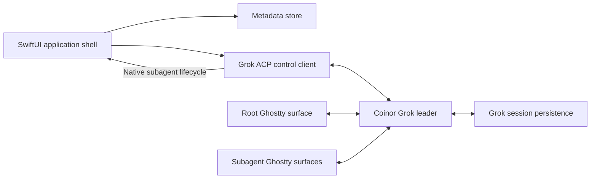

# Coinor architecture

## Purpose

Coinor is a personal, native macOS application that gives Grok conversations a
Codex-like project sidebar and a Herdr-like multi-pane experience without
embedding either Paseo or Herdr.

Grok owns conversation state and execution. Coinor owns presentation,
organization metadata, terminal processes, and pane layout.

## Scope

Coinor deliberately supports:

- macOS 13 or newer
- the custom Grok binary used on this computer
- one main application window
- local Git repositories and their worktrees
- interactive root and subagent terminal panes
- local organization metadata

Coinor deliberately does not provide:

- cross-platform support
- its own transcript or task persistence
- a terminal or PTY server that survives application exit
- compatibility with arbitrary Grok versions
- Herdr or Paseo runtime dependencies
- cloud synchronization of Coinor metadata
- distribution through the Mac App Store or operation inside App Sandbox

## System shape



There are two separate integration planes:

1. The control plane uses ACP JSON-RPC for session catalog, activity, rename,
   and lifecycle coordination.
2. The render plane uses embedded Ghostty surfaces running the actual Grok TUI.

Coinor never parses terminal output to infer application state.

## Application components

### App coordinator

`AppCoordinator` owns the application lifecycle and composes the control
client, metadata store, project catalog, conversation runtimes, lifecycle
coordinator, and notification service.

It starts the isolated Grok leader before restoring the last visible
conversation and shuts down Coinor-owned clients when the application exits.

### Grok control client

`GrokControlClient` is a long-lived ACP JSON-RPC client implemented in Swift. It
starts Grok in stdio agent mode against Coinor's private leader socket:

```text
grok --leader-socket <coinor-socket> agent --leader stdio
```

Its responsibilities are:

- resolve and retain an absolute path to the configured Grok executable
- initialize the ACP connection
- page through `x.ai/session/list` for persisted session metadata and facets
- call `x.ai/sessions/list` for live and dormant activity state
- consume `x.ai/sessions/changed` notifications
- call `x.ai/session/rename` for root conversations
- provide explicit health and compatibility errors to the UI

The session catalog and live roster are joined by Grok session ID. Catalog rows
own project/worktree metadata; roster rows own current activity and residency.

### Isolated Grok leader

All Coinor-owned Grok clients use one socket beneath Coinor's Application
Support directory. Coinor passes `--leader` and `--leader-socket` explicitly;
it does not modify the machine-wide `use_leader` setting.

The leader exists because the root TUI and each visible subagent TUI must
subscribe to the same in-memory Grok sessions. The original root client remains
the session driver while additional clients receive replay and live updates.

Leader mode requires a Grok configuration that is eligible for leader
operation. Coinor must surface a clear startup error if Grok refuses leader
mode, including sandbox-policy failures.

### Conversation runtime manager

`ConversationRuntimeManager` owns every conversation activated during the
current application run.

Each runtime contains:

- one root terminal process and Ghostty surface
- zero or more subagent terminal processes and Ghostty surfaces
- current root and descendant activity
- pane ordering and focus state
- archive/unload state

Changing the selected conversation does not stop its runtime. Application
relaunch restores only the last visible runtime; other sessions resume lazily.

New root conversations use a Coinor-generated UUID passed to Grok so the UI
knows the durable session ID before the TUI finishes starting:

```text
grok --leader-socket <socket> --leader \
  --cwd <checkout> --session-id <uuid>
```

Existing conversations launch directly through:

```text
grok --leader-socket <socket> --leader \
  --cwd <session-cwd> --resume <session-id>
```

### Ghostty runtime

Coinor statically links `GhosttyKit.xcframework` built from a pinned Ghostty
source revision. It does not load or depend on `/Applications/Ghostty.app`.

`GhosttyRuntime` is the only module that imports the Ghostty C API.
`GhosttySurfaceView` bridges an AppKit surface into SwiftUI through
`NSViewRepresentable`.

At startup, the runtime:

1. points `GHOSTTY_RESOURCES_DIR` at Coinor's bundled resources
2. calls `ghostty_init` exactly once
3. creates one shared Ghostty application handle
4. creates a configuration and loads Ghostty's default and recursive files
5. finalizes the configuration and reports diagnostics
6. creates one surface per root or subagent pane

Each surface inherits the user's normal font, colors, and terminal behavior.
Coinor overrides the surface command, working directory, environment, and
initial size required by the pane.

`GhosttyActionBridge` handles clipboard completion, close requests, cursor
state, title and working-directory updates, URL opening, renderer health, and
configuration reload. Ghostty actions that would create native Ghostty
windows, tabs, or splits are ignored or mapped to Coinor behavior rather than
creating UI outside Coinor's pane model.

Ghostty wakeups can arrive off the main thread; the adapter schedules
`ghostty_app_tick` and AppKit work on `MainActor`. Surface callback userdata is
unretained, so the runtime owns explicit lifetimes and always destroys every
surface before freeing the shared application handle.

The pinned Ghostty revision, C header, static framework, and resources are one
indivisible build artifact. Coinor builds its copy with Ghostty crash reporting
disabled. A Ghostty update is an explicit dependency update followed by
terminal integration tests.

### Native Grok lifecycle

Grok publishes `subagent_spawned`, `subagent_progress`, and
`subagent_finished` updates through the same ACP connection Coinor already
uses for its control plane. Coinor consumes those native notifications and
recursively replays persisted lifecycle updates after reconnecting or opening
an existing conversation. It does not install global hooks, run an auxiliary
relay, or create a lifecycle socket.

The lifecycle update identifies the immediate parent and child session IDs.
Coinor maps every descendant back to the activated root conversation, opens a
Ghostty surface, and runs:

```text
grok --leader-socket <socket> --leader \
  --cwd <event-cwd> --resume <subagent-id>
```

The native start update can arrive before the new child has written its
persisted summary. A small Coinor launcher retries only the exact "session does
not exist" startup failure for a bounded period, then hands the successful Grok
TUI to the same terminal. Other failures surface immediately.

Lifecycle handling is idempotent by subagent ID. Start/finish events are
generation-checked so a delayed start cannot resurrect a pane after its
finish. Events received before a root runtime is ready are buffered. Closing a
root runtime closes all of its descendant panes.

The ACP stream can be interrupted by cancellation, provider failure, leader
restart, or abrupt parent death. The lifecycle reconciler therefore also:

- closes every descendant when the ultimate root terminal process exits
- observes child persisted events for cancellation or terminal outcomes
- keys liveness to the root session, never an intermediate nested subagent
- immediately restores the descendant tree when a pane opens
- periodically replays lifecycle state while descendants remain active

### Pane layout

`ConversationView` renders:

- root only: one full-width terminal
- root plus descendants: a fixed 50/50 horizontal split
- right side: equal-height vertical tracks in subagent start order

All surfaces remain mounted while their conversation runtime is live, even
when another conversation is selected. Hidden runtimes do not lose their PTY
or in-flight work.

### Sidebar presentation

`NavigationSplitView` owns the sidebar structure and system material. On macOS
26 or newer, `ConversationContentView` uses `backgroundExtensionEffect()` so
the terminal edge continues subtly beneath the system Liquid Glass. Coinor
does not stack `glassEffect`, `NSGlassEffectView`, `NSVisualEffectView`, custom
tints, or opaque list backgrounds over the navigation sidebar. On earlier
macOS versions, the same structure falls back to the platform's standard
sidebar material.

Sidebar action icons use adaptive label colors. Project and conversation row
text uses a light system weight. Project-specific display names and SF Symbol
choices come from Coinor metadata and do not alter the repository.

### Session and project catalog

`SessionCatalog` combines Grok data with Coinor metadata.

Grok provides:

- session ID and title
- current and source working directories
- Git root and source-workspace facets
- worktree status
- last activity
- live activity state

`ProjectResolver` determines project identity from the canonical Git common
directory. All linked worktrees resolve to the same project. Independent clones
have different common directories and remain separate.

The primary checkout is resolved from `git worktree list --porcelain`.
Manually registered repositories are retained even when they have no sessions.

### Worktree creation

Coinor's add menu offers `In Main Checkout` and `In New Worktree`.

For a new worktree:

1. require a user-provided name
2. resolve the remote and its default branch
3. run `git fetch <remote>` without modifying the primary checkout
4. launch Grok with `--worktree=<name>` and
   `--worktree-ref=<remote>/<default-branch>`
5. if fetch or resolution fails, omit `--worktree-ref`, use local `HEAD`, and
   show a non-blocking English warning

The resulting conversation remains a flat child of the project in the sidebar.

### Metadata store

Coinor persists a small, versioned JSON document beneath Application Support
using atomic replacement. A database is unnecessary for the expected data
volume and single-process writer.

Stored metadata includes:

- manually registered projects
- optional project display names and SF Symbol icon choices
- archived project identities
- pinned and archived conversation IDs
- pin ordering
- last visible conversation ID
- lightweight UI state such as expanded projects

Coinor does not store transcripts, prompts, terminal scrollback, Grok activity,
or duplicate conversation titles.

Subagent sessions are hidden implementation sessions rather than sidebar
conversations. Coinor does not offer pin, archive, or rename actions for them.

### Activity and notifications

The root conversation aggregates activity from itself and all descendants:

1. `NeedsInput` has highest priority
2. `Working` is next
3. idle, dormant, or completed has no active indicator
4. dead sessions show an error state

Aggregated state propagates to the conversation row and project. Selecting a
conversation needing attention focuses the requesting pane.

Coinor sends a native macOS notification only when it is not the focused
application.

## Compatibility contract

Coinor is intentionally coupled to the custom Grok build. On startup it must:

1. resolve the configured Grok executable to an absolute path
2. record `grok --version`
3. initialize the ACP control connection
4. probe the required extension methods
5. verify leader startup
6. verify native subagent lifecycle parsing and replay compatibility

An unsupported binary produces one actionable English diagnostic instead of a
partially working interface.

## Licensing boundary

Coinor copies neither Paseo nor Herdr code. Their interfaces are product
references only.

Ghostty is consumed under its source license through a pinned build artifact.
Grok integration targets the user's custom local fork.

## Principal risks

1. Ghostty's full embedding API is not yet a stable general-purpose API.
2. Ghostty framework resources, header, and AppKit lifecycle must remain on the
   exact same pinned revision.
3. Grok extension methods are custom contracts and can change with the fork.
4. Missed or reordered lifecycle updates can leave stale panes without replay.
5. Leader mode is incompatible with restrictive Grok sandbox profiles.
6. Several simultaneously mounted terminal surfaces can consume substantial
   memory and GPU resources.
7. Git fetch and default-branch discovery can fail for authentication,
   connectivity, or unusual remote layouts.
8. Finder-launched applications do not inherit the user's interactive shell
   environment, so relative command lookup is unreliable.
9. A native subagent start can race the child's first persistence write.

The implementation plan gates full product work behind prototypes for the
highest integration and lifecycle risks above.
